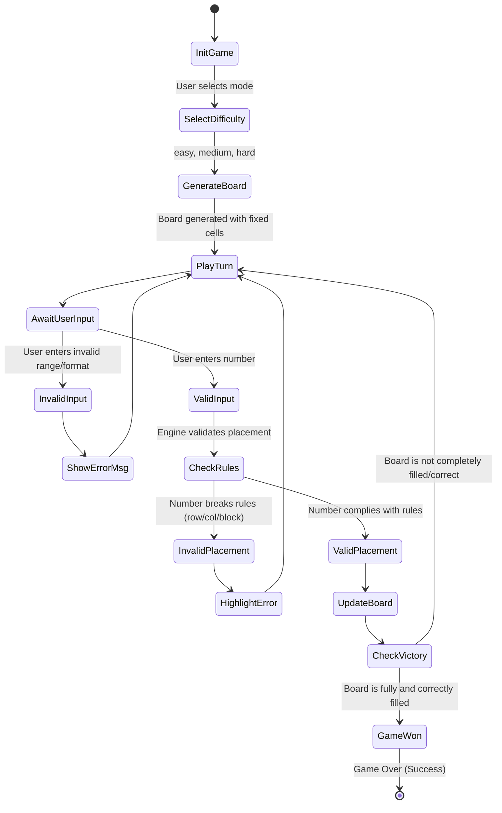

# Activity Diagram - Sudoku Gameplay Flow

```mermaid
stateDiagram-v2
    [*] --> InitGame
    
    InitGame --> SelectDifficulty : User selects mode
    SelectDifficulty --> GenerateBoard : easy, medium, hard
    
    GenerateBoard --> PlayTurn : Board generated with fixed cells
    
    PlayTurn --> AwaitUserInput
    
    AwaitUserInput --> ValidInput : User enters number
    AwaitUserInput --> InvalidInput : User enters invalid range/format
    
    InvalidInput --> ShowErrorMsg
    ShowErrorMsg --> PlayTurn
    
    ValidInput --> CheckRules : Engine validates placement
    
    CheckRules --> ValidPlacement : Number complies with rules
    CheckRules --> InvalidPlacement : Number breaks rules (row/col/block)
    
    InvalidPlacement --> HighlightError
    HighlightError --> PlayTurn
    
    ValidPlacement --> UpdateBoard
    UpdateBoard --> CheckVictory
    
    CheckVictory --> PlayTurn : Board is not completely filled/correct
    CheckVictory --> GameWon : Board is fully and correctly filled
    
    GameWon --> [*] : Game Over (Success)
```
