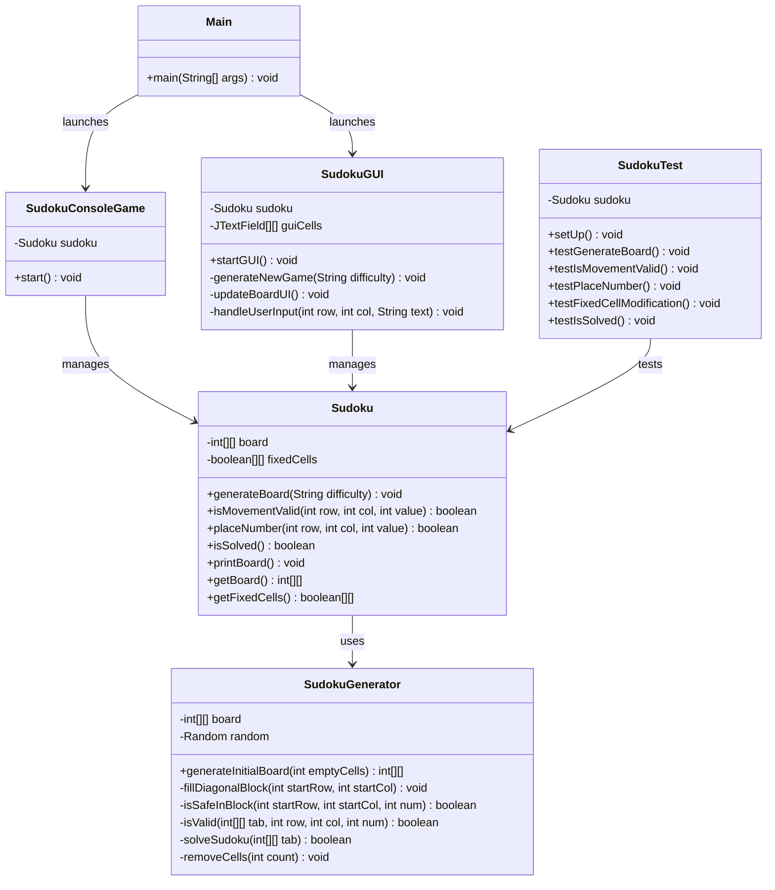

# Class Diagram - Sudoku in Java

```mermaid
classDiagram
    class Sudoku {
        -int[][] board
        -boolean[][] fixedCells
        +generateBoard(String difficulty) void
        +isMovementValid(int row, int col, int value) boolean
        +placeNumber(int row, int col, int value) boolean
        +isSolved() boolean
        +printBoard() void
        +getBoard() int[][]
        +getFixedCells() boolean[][]
    }

    class SudokuGenerator {
        -int[][] board
        -Random random
        +generateInitialBoard(int emptyCells) int[][]
        -fillDiagonalBlock(int startRow, int startCol) void
        -isSafeInBlock(int startRow, int startCol, int num) boolean
        -isValid(int[][] tab, int row, int col, int num) boolean
        -solveSudoku(int[][] tab) boolean
        -removeCells(int count) void
    }

    class SudokuConsoleGame {
        -Sudoku sudoku
        +start() void
    }

    class SudokuGUI {
        -Sudoku sudoku
        -JTextField[][] guiCells
        +startGUI() void
        -generateNewGame(String difficulty) void
        -updateBoardUI() void
        -handleUserInput(int row, int col, String text) void
    }

    class Main {
        +main(String[] args) void
    }

    class SudokuTest {
        -Sudoku sudoku
        +setUp() void
        +testGenerateBoard() void
        +testIsMovementValid() void
        +testPlaceNumber() void
        +testFixedCellModification() void
        +testIsSolved() void
    }

    Sudoku --> SudokuGenerator : uses
    SudokuConsoleGame --> Sudoku : manages
    SudokuGUI --> Sudoku : manages
    Main --> SudokuConsoleGame : launches
    Main --> SudokuGUI : launches
    SudokuTest --> Sudoku : tests
```
