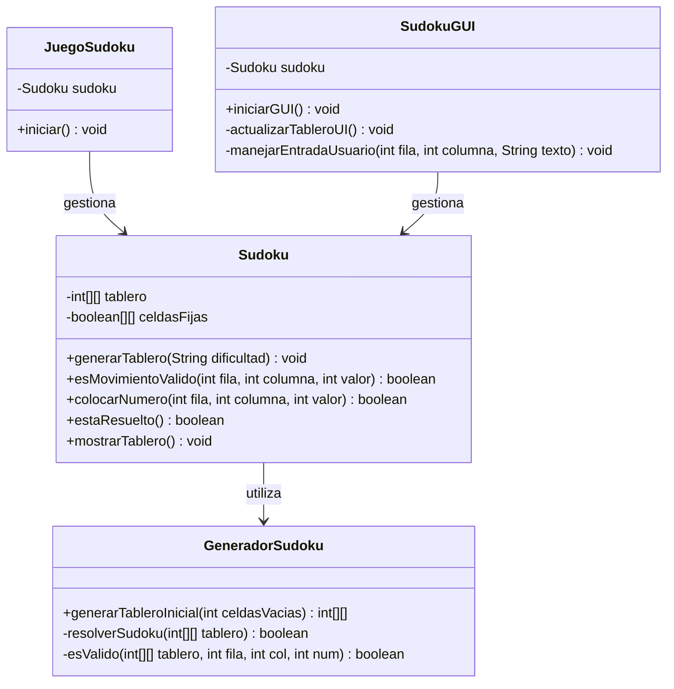

# Diagrama de Clases - Sudoku en Java

```mermaid
classDiagram
    class Sudoku {
        -int[][] tablero
        -boolean[][] celdasFijas
        +generarTablero(String dificultad) void
        +esMovimientoValido(int fila, int columna, int valor) boolean
        +colocarNumero(int fila, int columna, int valor) boolean
        +estaResuelto() boolean
        +mostrarTablero() void
    }

    class GeneradorSudoku {
        +generarTableroInicial(int celdasVacias) int[][]
        -resolverSudoku(int[][] tablero) boolean
        -esValido(int[][] tablero, int fila, int col, int num) boolean
    }

    class JuegoSudoku {
        -Sudoku sudoku
        +iniciar() void
    }

    class SudokuGUI {
        -Sudoku sudoku
        +iniciarGUI() void
        -actualizarTableroUI() void
        -manejarEntradaUsuario(int fila, int columna, String texto) void
    }

    Sudoku --> GeneradorSudoku : utiliza
    JuegoSudoku --> Sudoku : gestiona
    SudokuGUI --> Sudoku : gestiona
```
